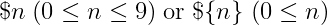

# `Linux`课程`shell`编程实验

## 实验目的

使用`shell`进行编程，使得程序能够完成以下功能：
将给定的源文件夹中的文件按照**后缀名**进行分类，并复制到目标文件夹中的各子文件夹中（各子文件夹以对应后缀名作为文件夹名）。同时，在目标文件夹中，应当有一个**analysis.txt**的分析文件，至少需要记录各文件的原始路径，现路径与其后缀名等信息。

## 实验准备

*   系统环境：WSL2 Kali x86_64 GNU/Linux
*   解释器：GNU bash, version 5.1.0(1)-rc2 (x86_64-pc-linux-gnu)
*   编辑器：VIM - Vi IMproved 8.2

## 实验时间

2020年11月12日

## 实验内容

编程实现`shell`脚本`classify.sh`，实现按后缀名对文件夹中文件分类的功能

1.  源文件夹与目的文件夹通过参数的方式传入，若未指定源文件夹，则以当前文件夹为源文件夹；若未指定目标文件夹，则需要在临时目录（`/tmp`）中创建临时文件夹来进行存储。

2.	程序应当判断目标文件夹是否已存在，若已存在，则需要在文件夹名后面加上一个随机子串，防止破坏原有文件夹结构。

3.	若出现文件重名，需要在新加入的文件后缀名前添加数字段以保证复制的正常进行，如：若`main.cpp`发生冲突，则需要修改文件名为`main.2.cpp`，依次类推。

4.	程序需要输出源文件夹、目标文件夹、分析文件的路径。

5.	分析文件可以使用`column`命令进行对齐。

## 基本原理

### 参数处理

为了实现对脚本传参，需要实现对参数的处理
1. `shell`中脚本或函数获得的参数，由以下语法引用

    

    其中$0表示脚本名，$1, $2, ... , ${n}表示第n个参数

2. `shift`默认参数为1，接受整数参数来移动指向参数数组的下标。可以理解为对参数队列出队n次（n为正整数）

[Shell scripting: Parsing command-line arguments and flags easily](https://pretzelhands.com/posts/command-line-flags)

### 生成随机数
`$RANDOM`生成15bits的随机数（0~32768）

[linux shell实现随机数多种方法（date,random,uuid)](https://www.cnblogs.com/chengmo/archive/2010/10/23/1858879.html)

### 获得`extension`
1.  使用`shell`的`substr`语法
    ```bash
    bname=`basename -- $path`
    stem="${bname%.*}" 
    ext="${bname##*.}"
    ```

2.  使用sed：sed不仅支持子串替换，还支持**删除没有后缀的文件名**，用途更广泛
    ```bash
    EXT=`echo -n "$file" | sed -E 's/^.*\/(.*)/\1/g' | sed -E '/^[^.]+$/d' | sed -E '/^\..+$/d' | sed -E '/^.+\.$/d' | sed -E 's/^.+\.(.+)/\1/g'`
    ```
    >   如果文件没有后缀名，比如（`.vimrc`、`has.`、`i_am_no_dot`），`EXT`返回空串来帮助判断

### 遍历文件夹
`shell`没有类似`Python`的`pathwalk`功能，可以方便的遍历文件夹和**子文件夹**，但是我们可以借助`find`递归地获得所有文件路径
```bash
find "${src}" -type f > "${file_info}" 
```

## 实现过程

### 流程图


### 核心代码

#### 参数处理

```bash
# Default parameters
src="."
dst="/tmp/classified"
ver=""

[[ $# -eq 1 ]] && { src="."; dst="$1"; };
while [[ $# -gt 0 ]]; do
    para="$1"
    case $para in
        -h|--help)
            printUsage
            exit 1
            ;;
        -s|--source)
            src="$2"
            shift 2
            ;;
        -v|--verbose)
            ver="true"
            shift
            ;;
        *) 
            dst="$1"
            shift
            ;;
    esac
done
```

#### 对文件夹添加后缀

```bash
if [ -e $dst ]; then 
    echo -n "${dst} already exist, "
    dst="${dst}_${RANDOM}"
    echo "target changed to ${dst}"
fi
```

#### 获取后缀名信息

```bash
ext_info="${src}/.ext_info"
find "$src" -type f | sed -E 's/^.*\/(.*)/\1/g' | sed -E '/^[^.]+$/d' | sed -E '/^\..+$/d' | sed -E '/^.+\.$/d' | sed -E 's/^.+\.(.+)/\1/g' | sort | uniq > "$ext_info"
```

#### 复制文件（自动重命名）

```bash
# Copy file with numbered backup
# e.g. tmp.cpp => tmp.2.cpp
# $1= file $2 = target
START=2
cpWithBak() {
    bname=`basename -- $1`
    fname="${bname%.*}"
    ext="${bname##*.}"
    flag=""
    num=${START}
    while [ -z $flag ]; do
        if [ -e "${2}/${bname}" ]; then
            bname="${fname}.${num}.${ext}"
            let "num++"
        else
            flag="true"
        fi
    done

    if [[ $num -gt ${START} && -n $ver ]]; then 
        echo "${2}/${fname}.${ext} already exist, ${1} saved as ${2}/${bname}"
    fi
    # append to analysis.txt
    echo "${1} ${2}/${bname} ${ext}" >> "${analysis}"
    cp "${1}" "${2}/${bname}"
}
```

### 运行结果

**查看help info**
```
┌──(kali㉿DESKTOP-16RPVG1)-[~/Linux-Shell-Expr]
└─$ ./classify.sh --help                    
classify -- Classify directory by file-extension

Usage: ./classify.sh [OPTION]... [traget]

Options:
    -h --help    : print help information
    -s --source  : specify the source directory, default to current directory
    -v --verbose : print processing information

Note: if argument or option argument is duplicated, the last one will be taken
```

**运行**
```
┌──(kali㉿DESKTOP-16RPVG1)-[~/Linux-Shell-Expr]
└─$ ./classify.sh
/tmp/classified already exist, target changed to /tmp/classified_25296
source: .
target: /tmp/classified_25296
analysis: /tmp/classified_25296/analysis.txt
```

**运行（带option）**
```
┌──(kali㉿DESKTOP-16RPVG1)-[~/Linux-Shell-Expr]
└─$ ./classify.sh -v -s ~/fragment 
/tmp/classified already exist, target changed to /tmp/classified_7530
source: /home/kali/fragment
target: /tmp/classified_7530
Total: 4 directory are created
/tmp/classified_7530/.clang-format already exist, /home/kali/fragment/ranges-v3-pieces/examples/views/.clang-format saved as /tmp/classified_7530/.clang-format_2
/tmp/classified_7530/.clang-format already exist, /home/kali/fragment/ranges-v3-pieces/examples/actions/.clang-format saved as /tmp/classified_7530/.clang-format_3
/tmp/classified_7530/.clang-format already exist, /home/kali/fragment/ranges-v3-pieces/examples/algorithms/.clang-format saved as /tmp/classified_7530/.clang-format_4
/tmp/classified_7530/out/a.out already exist, /home/kali/fragment/ranges-v3-pieces/misc/a.out saved as /tmp/classified_7530/out/a.2.out
/tmp/classified_7530/out/a.out already exist, /home/kali/fragment/boost-pieces/string-processing/string-algorithms/a.out saved as /tmp/classified_7530/out/a.3.out
/tmp/classified_7530/out/a.out already exist, /home/kali/fragment/boost-pieces/string-processing/format/a.out saved as /tmp/classified_7530/out/a.4.out
/tmp/classified_7530/out/a.out already exist, /home/kali/fragment/boost-pieces/string-processing/a.out saved as /tmp/classified_7530/out/a.5.out
/tmp/classified_7530/out/a.out already exist, /home/kali/fragment/boost-pieces/function-object/a.out saved as /tmp/classified_7530/out/a.6.out
/tmp/classified_7530/out/a.out already exist, /home/kali/fragment/boost-pieces/date_time/a.out saved as /tmp/classified_7530/out/a.7.out
/tmp/classified_7530/out/a.out already exist, /home/kali/fragment/boost-pieces/lex/a.out saved as /tmp/classified_7530/out/a.8.out
/tmp/classified_7530/out/a.out already exist, /home/kali/fragment/boost-pieces/tuple/a.out saved as /tmp/classified_7530/out/a.9.out
analysis: /tmp/classified_7530/analysis.txt
```

### 运行截图

**打印help info**


**运行+查看analysis.txt**


**运行（带option）+ tree**


## 实验总结

### 实验过程分析

`classify.sh`的默认目的文件夹是`/tmp`，默认源地址是`./`。所以运行`./classify.sh`等价于运行`./classify.sh -s ./ /tmp`。`-h/--help`选项打印help info并退出脚本，`-s/--source`选项给定源文件夹。`classify.sh`自己接受参数作为目的地址。当选项参数或参数多次给出时，采纳最后给出的参数（除了`-h/--help`选项，它会直接退出脚本）。

`classify.sh`默认输出源文件夹，目标文件夹和分析文件的路径。如果目标文件夹出现重复，则提示自动重命名。如果给定`-v/-verbose`选项，则会打印生成的子文件夹数，和复制过程中自动重命名的文件。

对于有后缀和没有后缀的文件，`classify.sh`在处理上有所不同，对于有后缀的文件，复制到对应子文件夹中，而没有后缀的文件复制到目标文件夹下。当发现重名时，有后缀的文件在中间添加序号（为了不改变文件后缀名），比如`tmp.c`改为`tmp.2.c`。而对于无后缀的文件，则在末尾添加，比如`i_has_no_dot`改为`i_has_no_dot_2`

### 心得体会


1.  掌握了`shell`条件控制、`shell`函数、`shell`文件、文件夹的操作、`shell`文件的读写的知识

2.  掌握了`find sed basename read`等常用命令的使用方法

3.  学习了`shell`参数处理的知识
